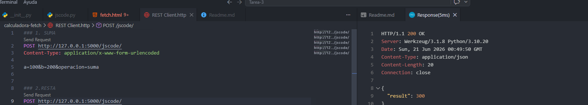
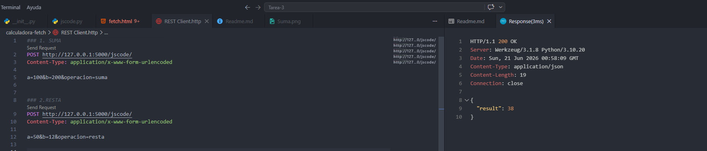
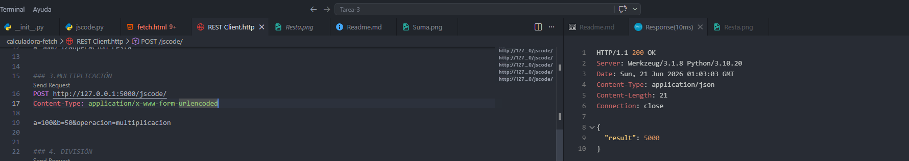
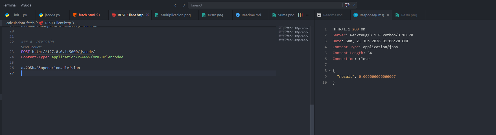

# Calculadora Dinámica con JavaScript (AJAX) y Flask

### 1. Implementación en la Vista (fetch.html)
Se integró la etiqueta `<select>` dentro del formulario para permitir al usuario alternar entre las operaciones disponibles como suma,resta,multiplicacion y division.

```html
<select name="operacion">
  <option value="suma">+</option>
  <option value="resta">-</option>
  <option value="multiplicacion">×</option>
  <option value="division">÷</option>
</select>
```
Se va a evidenciar las siguientes operaciones: 
### a. Suma (100 + 200)

### b. Resta (50 - 12)

### c. Multiplicacion (100 * 50)

### d. Division (20 / 3)


